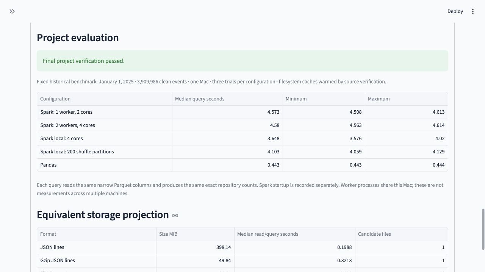
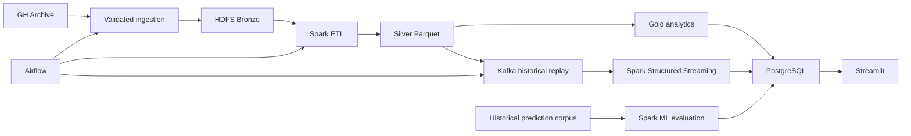

# DevPulse — GitHub Activity Analytics

A complete data engineering project for analyzing historical public GitHub activity,
repository participation, technology associations, and future repository attention.
DevPulse combines batch processing, historical-event streaming, chronological machine
learning evaluation, and an interactive dashboard.

**All eight project stages are completed and verified locally, with 231 passing tests.**
Detailed run reports and datasets are generated and retained locally. This repository
contains the implementation, documentation, notebook, tests, and a dashboard preview.



## What it does

- Collects bounded GH Archive windows with streaming downloads, gzip validation,
  checksums, quotas, restartable ingestion, and atomic Bronze publication.
- Cleans nested events with explicit Spark schemas, UTC timestamps, deterministic
  deduplication, quarantine accounting, and immutable partitioned Parquet snapshots.
- Builds repository, public-account, hourly, and language-association analytics;
  publishes 15 verified tables atomically to PostgreSQL.
- Serves six Streamlit pages for activity, repositories, languages, accounts,
  historical predictions, and pipeline monitoring.
- Compares logistic regression, random forest, and gradient-boosted trees using
  past-only features and chronological train/validation/test windows.
- Runs bounded Airflow workflows and Kafka/Spark Structured Streaming replay with
  durable event deduplication, offset tracking, late corrections, and recovery checks.
- Benchmarks Pandas/Spark, one/two standalone workers, equivalent storage formats,
  and concurrent replay rates using real events and exact result parity.

## Architecture



The verified deployment uses native services and two separate Spark worker JVMs
on one Mac. It follows the project's small distributed deployment option.
Worker comparisons measure single-host behavior; cloud hosting and Docker
container deployment are future extensions.

## Measured datasets and results

| Area | Verified scope |
|---|---|
| Activity source | January 1, 2025: all 24 hourly archives; 3,909,993 raw records |
| Clean activity | 3,909,986 unique events; seven duplicates; zero quarantined |
| Analytics | 683,676 repositories; 419,709 public accounts; 15 Gold tables |
| Prediction corpus | 42 full UTC days in 2015; 1,008 archives; 19,669,354 unique eligible events |
| Historical replay | One complete 223,540-event hour; independent crash/restart and late-arrival verification |
| Rate experiment | Six concurrent producer/consumer trials, 20,000 real events each |
| Compute benchmark | Three trials per configuration; identical exact results for every configuration |

The selected gradient-boosted model achieved held-out PR-AUC **0.147934** and
ROC-AUC **0.924828**. The locally generated model report includes target prevalence, baselines,
precision at selected ranks, decision threshold, and confusion counts.

Pandas was faster for the tested narrow in-memory workload. A second worker
provided little improvement on this Mac. Hour-partitioned Parquet reduced the
candidate files for the measured hour query. Locally generated performance
reports record cache, timing, memory, storage-projection, and latency scope.

## Setup

The measured environment uses Python 3.12, Java 17, PySpark 4.0.1,
PostgreSQL 14, Hadoop 3.5, Kafka 4.2, Airflow 3.3, and Streamlit.
Python dependencies are pinned in `pyproject.toml`. Airflow runs in a separate
environment created by `python -m scripts.setup_week7`; its version is declared
in the same project configuration.

```bash
git clone https://github.com/Lalit287/devpulse-github-analytics.git
cd devpulse-github-analytics
python3.12 -m venv .venv
.venv/bin/python -m pip install --editable .
source scripts/activate.sh
python -m pip check
```

Dataset acquisition and native service setup are required on a new machine.
Follow the [setup guide](docs/setup_guide.md),
[ingestion/storage guide](docs/week2_ingestion_storage.md), and
[demonstration runbook](docs/demo_runbook.md).

For the existing, fully provisioned Desktop project:

```bash
cd ~/Desktop/DevPulse
.venv/bin/python -m deployment.runtime start
.venv/bin/python -m scripts.complete_week8 --reuse-benchmarks
```

The completion helper verifies service health, exact benchmark parity, the model
corpus, preserved artifacts, and the full test suite before recording completion.
It reuses completed benchmarks. Omit `--reuse-benchmarks` to repeat the measured
experiments. Run PostgreSQL startup in a normal Terminal if macOS restricts the
app's shared-memory operation.

Local endpoints: Streamlit `http://127.0.0.1:18501`, Airflow
`http://127.0.0.1:18080`, Spark master `http://127.0.0.1:18081`, and HDFS
NameNode `http://127.0.0.1:19870`.

## Tests

Portable offline contract checks, also used by GitHub Actions:

```bash
.venv/bin/python -m pytest tests/test_week7_contracts.py tests/test_week8_contracts.py -q
```

The full suite requires the locally provisioned datasets and native services:

```bash
.venv/bin/python -m pytest tests -q
```

## Project layout

| Directory | Purpose |
|---|---|
| `ingestion/`, `storage/` | Validated collection, Bronze publication, HDFS lifecycle |
| `spark/`, `analytics/`, `enrichment/` | ETL, analytics, cached public GitHub metadata |
| `database/`, `dashboard/` | Atomic PostgreSQL loading and read-only dashboard |
| `modeling/` | Historical corpus, features, chronological evaluation and serving |
| `orchestration/`, `streaming/` | Airflow workflows, Kafka replay and transactional streaming sink |
| `benchmarks/`, `deployment/` | Measured evaluation and local deployment management |
| `tests/` | Contracts, recovery, native integration and regression checks |
| `docs/` | Architecture, operations guides, contracts and dashboard preview |

Large datasets, trained model artifacts, credentials, virtual environments,
service storage, scratch output, logs, and generated Hadoop configuration stay
local and are excluded from Git. HDFS configuration is generated for the current
machine by the lifecycle commands. Generated reports, execution evidence and legacy dependency inventories stay local.
The installation configuration lives in `pyproject.toml`.

## Interpretation

Activity and prediction use separate historical windows. Public events omit
private activity, include bots, and do not measure complete developer productivity.
Star actions are observed WatchEvents rather than cumulative historical stars.
Language enrichment has limited coverage and associates current metadata with
historical activity. Model scores are uncalibrated, and the forecast week's actual
outcomes are outside the collected corpus. Local worker measurements do not
establish scaling across multiple machines.

[Architecture](docs/architecture.md) · [Dataset catalog](docs/data_catalog.md) ·
[Model evaluation guide](docs/week6_prediction.md) · [Demo and recovery runbook](docs/demo_runbook.md)
