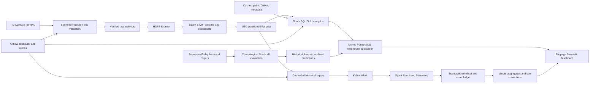

# DevPulse architecture

DevPulse measures historical public GitHub activity. Its activity warehouse covers
January 1, 2025; its separate prediction experiment covers January 1–February 11,
2015. Language/topic metadata was collected later and is explicitly associated with
historical activity, not treated as historically observed repository languages.

## Contracts and identity

Archives carry HTTPS provenance, compressed bytes, SHA-256, gzip completeness,
record counts and hourly status. A completed input manifest is required for ETL.
Silver accounts for every input line as clean, duplicate or quarantined, preserves
exact integer IDs, retains event-specific payload JSON, and partitions by event time.
It distinguishes source archive time from event time.

Silver, Gold and model outputs are immutable snapshots with inventory checksums and
atomic current pointers. Gold implements exact distinct account counts, observed
star/fork actions and explicitly equal intraday comparison windows. PostgreSQL loads
and validates all tables in one transaction, with a read-only dashboard login.
Failed loads preserve the previous serving dataset. Model publication is separately
atomic and records its historical target, feature cutoff and chronological splits.

The Kafka sink commits offset receipts, unique events, aggregate repairs and counters
in one SQL transaction. Spark checkpoint replays are safe because offset and event-ID
keys are durable. Late unique events revise their original minute rather than being
silently dropped. This is an idempotent sink bridge, not a distributed transaction
between Kafka and PostgreSQL.

## Execution and deployment

The verified deployment runs on this Mac with bounded native services. Spark
standalone has one master and two worker JVMs, two cores and 4 GiB admitted memory
per worker. A full-day ETL and core analytics run is verified on both workers. Shared
local paths are suitable for this single-host demonstration; a multi-host deployment
would need shared/HDFS inputs, distributed dependency delivery and appropriate
network security. Worker scaling results are not multi-machine measurements.

Airflow, PostgreSQL, Hadoop, Kafka and Streamlit have project-owned directories and
loopback endpoints. Airflow's local authentication and Kafka/HDFS single-node
replication are development choices. Production authentication, TLS/SASL, resource
capacity, retention, disaster recovery and remote infrastructure remain deployment
choices rather than claims about this demonstration.
