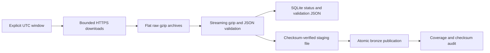

# Week 2 — Restartable ingestion and raw storage

Week 2 implements the roadmap's automated collection and HDFS storage milestone.
It preserves the Week 1 sample/notebook and leaves cleaning, deduplication, Parquet
ETL, analytics models, and Airflow to later weeks. Read the measured results in
`reports/week2_report.md`; downloaded data is not presented as transformed data.

## What is implemented

- UTC windows from 1 to 744 hours, or inclusive start/end dates, with a read-only plan.
- Streaming download, gzip CRC validation, recorded SHA-256, bounded retry, and raw quota.
- Streaming full-file JSON-object validation and per-hour event counts/quality summaries.
- A standard-library SQLite ledger for downloads, validations, destinations, and runs.
- OS locks for raw-directory writers and collection-state writers. Crash exit releases
  locks; a stale lock file alone never blocks recovery.
- Date/hour bronze partitions for local files or real HDFS, with atomic publication
  after a staging checksum check. Existing destinations are reused only after a
  checksum match; conflicting content is preserved and reported as a failure.
- Coverage auditing against the explicitly requested UTC window, with CSV/JSON inventory.
- A latest-completed-hour job entry point with a publication buffer and scheduler guidance.

## Run from the project root

```bash
cd ~/Desktop/DevPulse
source scripts/activate.sh
# Plan without downloading, creating a database, or starting HDFS:
python -m ingestion.collect --date 2025-01-01 --hours 24 --backend hdfs --dry-run

# Start only this project's NameNode and DataNode, then collect:
python -m storage.hdfs_cluster start
python -m ingestion.collect --date 2025-01-01 --hours 24 --backend hdfs \
  --max-disk-mb 4096 --max-storage-mb 4096
python -m ingestion.audit --backend hdfs --verify-storage

# Rerun the identical window to verify recovery/idempotency:
python -m ingestion.collect --date 2025-01-01 --hours 24 --backend hdfs
python -m storage.hdfs_cluster stop
```

The measured demonstration uses one full day. Larger windows are supported but
were not downloaded automatically. Inspect a plan and increase both budgets only
when available disk capacity supports the source files plus HDFS block storage.
A failed run returns exit code 1 and records exact failed/not-processed hours.
Rerun the same command after resolving the cause; completed source files and
published files are reverified and reused, not downloaded again.

```bash
# Seven-day plan only:
python -m ingestion.collect --date 2025-01-01 --end-date 2025-01-07 --dry-run
# Local bronze alternative, which works without HDFS:
python -m ingestion.collect --date 2025-01-01 --hour 12 --hours 1 --backend local
python -m ingestion.audit --backend local --verify-storage
```

## Data flow and partition contract



```text
data/raw/2025-01-01-3.json.gz
data/metadata/ingestion.sqlite3
data/metadata/validation/2025-01-01-3.json.gz.json
data/metadata/collections/<run-id>.json
data/metadata/latest_collection.json

HDFS: /devpulse/bronze/date=2025-01-01/hour=03/2025-01-01-3.json.gz
Local: data/bronze/date=2025-01-01/hour=03/2025-01-01-3.json.gz
```

Archive filenames use an **unpadded** hour, matching GH Archive's actual download
contract. Partition directory names use a padded hour for sorting. The original
blueprint's `-00`/`-01` filename examples are not used. Archive partition hour is
collection selection, while the validation summary's timestamps are observed
`created_at` values. No events are fabricated to fill absent timestamps or hours.

## Validation, state, and recovery

The download manifest is written only after gzip validation, and source identity
is recorded from the HTTPS download. A gzip file with a changed recorded SHA-256
is replaced through a new validated temporary download. An unverified preexisting
file is downloaded again rather than being silently assigned real-data provenance.

The JSON validator streams every line, rejects malformed/non-object JSON, empty
inputs, blank lines, overlong lines, and gzip corruption. Missing common fields
and invalid event timestamps are measured as quality diagnostics; they are not
silently repaired. These diagnostics are inputs to Week 3's defined data contract.
Duplicate event removal is also Week 3 work; full-source counts are raw event rows.

SQLite archive states are `downloading`, `validated`, and `failed`. Publication
records are keyed by filename, backend, and destination; changing backends does
not erase the other destination's records. Runs preserve their explicit windows
and final state: `complete`, `failed`, or `interrupted`. A storage failure keeps
the source validation reusable. Cached JSON-validation results are reused only
when the downloaded-file hash and validator version match. Source gzip and
checksums are still checked on reruns, and existing bronze files are hashed again.

Collection manifests are immutable run snapshots. `latest_collection.json`
points to the most recent run, including a failure, so a failed latest run is not
hidden behind an older successful result. Pass `--manifest` to audit an older
specific run. A CSV audit marks every expected hour, rather than only listing
the files that happened to succeed.

## Resource budgets and concurrency

The raw quota counts existing raw-directory files plus temporary download bytes.
Default Week 2 raw and storage budgets are each 4096 MiB. The Week 1 downloader's
500 MiB default remains unchanged; after collecting a day, use the Week 2 CLI for
additional downloads or explicitly set its quota. HDFS applies a server-enforced
space quota under the managed bronze root. Replication is 1. Local bronze's budget
counts logical bytes, even when a hard link avoids a second physical copy.

Local publication first tries a hard link, then a streaming copy for cross-device
layouts. It uses a second atomic link to publish without overwriting a competing
target. Every temporary file has a unique name. An HDFS upload is verified by
length and SHA-256 through a streamed read, then renamed within its partition.
This intentionally costs an extra read to prove integrity.

One collection process owns a metadata directory at a time. All downloader
invocations sharing a raw directory also serialize. Use the same metadata ledger
for jobs sharing a bronze destination; external concurrent HDFS writers are not
part of this single-machine development workflow. HDFS reserves block space for
in-progress writes, so a quota can reject a file before its final byte count would
reach the quota. The recorded error is preserved and no partial file is published.

## Automation and missed-hour handling

```bash
# Run one buffered completed hour; defaults to local storage:
bash scripts/collect_latest.sh --lag-hours 6
# HDFS alternative, after starting the project cluster:
bash scripts/collect_latest.sh --backend hdfs --lag-hours 6
```

The latest-hour selector operates in UTC and subtracts one fully completed hour
plus the configured lag. A six-hour buffer is a conservative archive-publication
allowance, not a claim of real-time ingestion. Repeating the job for the same hour
is idempotent. If the laptop was asleep, run an explicit range to backfill missed
hours and audit that range. The scheduler does not infer coverage for hours it
never requested.

A reviewed optional crontab line for this machine is:

```cron
20 * * * * /bin/bash /Users/lalitaditya/Desktop/DevPulse/scripts/collect_latest.sh >> /Users/lalitaditya/Desktop/DevPulse/reports/week2/scheduled_collection.log 2>&1
```

No recurring job or OS service has been installed automatically. A laptop must
be awake for cron to run, and cron does not catch up missed jobs. Enable a scheduler
only when you want ongoing bounded collection, review its exit codes/logs and
remaining quota, and use explicit backfills for gaps. Airflow orchestration is
planned for Week 7; it is not installed for Week 2.

## HDFS lifecycle and practical limits

The existing Hadoop 3.5.0 installation is reused. Its global configuration and
any existing HDFS data directories are untouched. DevPulse creates only:

- `config/hadoop/core-site.xml` and `hdfs-site.xml`
- `.runtime/hdfs/namenode/`, `datanode/`, `tmp/`, `logs/`, and `processes.json`
- A NameNode and DataNode on loopback ports 19000, 19870, 19864, 19866, and 19867

The initial empty NameNode directory is formatted once. Restart detects its
VERSION file and never reformats it. Unrecognized nonempty storage directories
are rejected. Startup checks occupied ports and waits for one registered DataNode
and safe-mode exit. Shutdown signals only JVM PIDs proven by their loopback JMX
runtime identity; it does not kill unrelated Hadoop processes. Heap limits are
512 MiB per daemon, and no YARN, secondary NameNode, SSH setup, Docker service, or
global shell configuration is needed. The development cluster remains available
for further project work. Stop it from your Terminal when it is no longer needed;
data persists for the next start.

Codex's execution sandbox can reject signals to daemons launched by an earlier
tool invocation with `Operation not permitted`. Run the stop command in your own
Terminal in that case. To verify the complete lifecycle within one process, use:

```bash
DEVPULSE_HDFS_PROFILE=verification python -m scripts.verify_week2 --start-cluster
```

This profile uses RPC port 19100 and HTTP/data ports 19970, 19964, 19966, and 19967,
with `config/hadoop-verification/` and `.runtime/hdfs-verification/`. It publishes
the same 24 existing real source archives, verifies them, restarts without
reformatting, checks all hashes again, and stops its own daemons. A SQLite backup
seeds a separate ledger in `work/week2/verification_metadata/`; the development
ledger and its latest manifest are not overwritten. The test profile is isolated
from the running development profile. Cleanup also runs if verification fails.
The measured restart and shutdown results are retained in the Week 2 report.

This is a **single-machine pseudo-distributed development demonstration**, not a
production cluster. Replication 1 provides no cross-machine redundancy. Loopback
simple authentication is suitable for this local exercise; production requires
an authenticated, secured deployment. Hadoop's native Linux libraries are not
used on macOS; its JVM fallback was exercised successfully here. Later Spark jobs
can read this HDFS URI explicitly; the Week 1 Spark demonstration continues to use
local file URIs and is not redirected by these settings.

References: [GH Archive](https://www.gharchive.org/),
[Hadoop 3.5.0 single-node setup](https://hadoop.apache.org/docs/r3.5.0/hadoop-project-dist/hadoop-common/SingleCluster.html),
[WebHDFS operations](https://hadoop.apache.org/docs/r3.5.0/hadoop-project-dist/hadoop-hdfs/WebHDFS.html).
