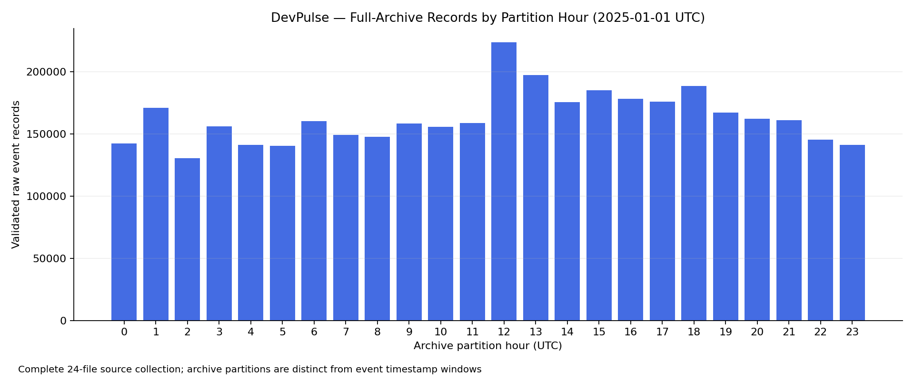

# DevPulse — Week 2 Ingestion and Storage Report

**Status: COMPLETE — all criteria satisfied.**
Prepared on 8 October 2026 (Asia/Kolkata). All data measurements below are from
actual full-file ingestion and streaming validation of real GH Archive inputs.

## 1. Objective and delivered scope

Week 2 completes the roadmap's collection and HDFS milestone: configurable UTC
windows, bounded downloads, full-file validation, recoverable status tracking,
raw bronze storage, coverage audits, and a reusable automation entry point.
Week 1 remains a separate preserved sample analysis. Spark cleaning, Parquet ETL,
deduplication, enrichment, predictions, dashboards, and Airflow remain later work.

- [x] DONE: Reusable bounded UTC date/range collection
- [x] DONE: Real full-day archive collection
- [x] DONE: Streaming gzip/JSON validation
- [x] DONE: Durable per-hour/run status and provenance
- [x] DONE: Date/hour HDFS bronze storage
- [x] DONE: Coverage and end-to-end checksum audit
- [x] DONE: Rerun downloads nothing and reuses 24 stored files
- [x] DONE: Real interruption/recovery and local bronze verification
- [x] DONE: Actual HDFS quota rejection preserves data
- [x] DONE: HDFS restart preserves the NameNode and all 24 files
- [x] DONE: Automated tests pass including Week 1 regressions
- [x] DONE: Week 1 artifacts preserved
- [x] DONE: Documentation and scheduler entry point
- [x] DONE: Final real-data integration verification

## 2. Environment and HDFS configuration

The existing Apple Silicon Mac, Python 3.12 virtual environment, Java 17, and
installed Hadoop 3.5.0 were reused. No new Python packages,
global Hadoop configuration, SSH configuration, or OS scheduling service was installed.
The project lives in `~/Desktop/DevPulse`.

Project configuration points at `hdfs://127.0.0.1:19000` and binds all five
NameNode/DataNode ports to loopback. `.runtime/hdfs/` holds only this project's
NameNode namespace, DataNode blocks, temporary state, and logs. Replication is 1;
the verified maximum daemon heap sizes are {'namenode': 536870912, 'datanode': 536870912} bytes.
This is a single-machine pseudo-distributed exercise, not a production cluster
or evidence of multi-machine scalability.

## 3. Real dataset collection

- Source: [GH Archive](https://www.gharchive.org/)
- Selected partition window: **2025-01-01 00:00 through 23:00 UTC**, inclusive
- Requested hourly files: **24**
- Successfully collected and validated files: **24**
- Newly downloaded during the full-day run: **23**
- Existing Week 1 source reused: **1**
- Full-source raw event records validated: **3,909,993**
- Compressed bytes: **1,618,723,169** (1.508 GiB)
- Collection gaps: **0**
- Raw and HDFS logical-space budgets: **4096 MiB each**

The source records were validated incrementally; compressed archives were never
loaded in their entirety for analysis. JSON-object validity and gzip CRC/trailer
integrity are required. Missing fields/timestamps are recorded as diagnostics and
not fabricated. Each source has a recorded SHA-256 and matching HDFS publication.
Full-file counts are raw observations, not deduplicated actions.

| Archive | Compressed bytes | Validated event rows |
|---|---:|---:|
| 2025-01-01-0.json.gz | 70,209,251 | 142,347 |
| 2025-01-01-1.json.gz | 76,479,472 | 170,960 |
| 2025-01-01-2.json.gz | 65,395,734 | 130,358 |
| 2025-01-01-3.json.gz | 75,175,108 | 155,887 |
| 2025-01-01-4.json.gz | 63,514,414 | 141,011 |
| 2025-01-01-5.json.gz | 58,059,728 | 140,309 |
| 2025-01-01-6.json.gz | 61,662,727 | 160,133 |
| 2025-01-01-7.json.gz | 61,055,908 | 149,305 |
| 2025-01-01-8.json.gz | 58,922,311 | 147,528 |
| 2025-01-01-9.json.gz | 62,528,603 | 158,104 |
| 2025-01-01-10.json.gz | 64,095,720 | 155,750 |
| 2025-01-01-11.json.gz | 64,748,907 | 158,512 |
| 2025-01-01-12.json.gz | 76,173,404 | 223,540 |
| 2025-01-01-13.json.gz | 75,465,126 | 197,224 |
| 2025-01-01-14.json.gz | 69,609,324 | 175,304 |
| 2025-01-01-15.json.gz | 72,578,615 | 185,049 |
| 2025-01-01-16.json.gz | 73,129,319 | 178,036 |
| 2025-01-01-17.json.gz | 70,455,601 | 175,988 |
| 2025-01-01-18.json.gz | 74,601,035 | 188,459 |
| 2025-01-01-19.json.gz | 69,897,024 | 167,103 |
| 2025-01-01-20.json.gz | 67,411,278 | 162,106 |
| 2025-01-01-21.json.gz | 66,381,290 | 160,796 |
| 2025-01-01-22.json.gz | 62,236,421 | 145,196 |
| 2025-01-01-23.json.gz | 58,936,849 | 140,988 |



## 4. Event types and quality observations

These are full-source ingestion counters, distinct from Week 1's 10,000-record
sample. Push events are pushes rather than commit totals; WatchEvents represent
observed starring actions rather than accumulated star counts.

| Event type | Full-source raw rows | Share |
|---|---:|---:|
| PushEvent | 2,704,255 | 69.16% |
| CreateEvent | 404,977 | 10.36% |
| PullRequestEvent | 238,549 | 6.10% |
| WatchEvent | 173,464 | 4.44% |
| IssueCommentEvent | 113,441 | 2.90% |
| DeleteEvent | 93,978 | 2.40% |
| IssuesEvent | 44,940 | 1.15% |
| ForkEvent | 39,772 | 1.02% |
| PullRequestReviewEvent | 36,515 | 0.93% |
| ReleaseEvent | 22,242 | 0.57% |
| PullRequestReviewCommentEvent | 16,142 | 0.41% |
| PublicEvent | 9,736 | 0.25% |
| MemberEvent | 5,458 | 0.14% |
| GollumEvent | 4,282 | 0.11% |
| CommitCommentEvent | 2,242 | 0.06% |

Common-field missing/null/blank diagnostics:

| Field | Missing records |
|---|---:|
| id | 0 |
| type | 0 |
| actor.id | 0 |
| actor.login | 0 |
| repo.id | 0 |
| repo.name | 0 |
| created_at | 0 |
| public | 0 |
| payload | 0 |

Invalid/missing event timestamps across all sources:
**0**.
Malformed JSON records and blank input lines are rejected by validation; this
completed run contains none. Repository language trends and developer productivity
are not inferred from these ingestion measurements.

## 5. State, publication, and recovery

`data/metadata/ingestion.sqlite3` persists archive, publication, and run status.
Collection JSON snapshots preserve each selected hour and all results, including
failures. Atomic download promotion and HDFS staging/rename keep incomplete data
out of final filenames. Existing published files with different checksums are
preserved and rejected as conflicts. Logs retain actual HTTP/Hadoop errors.

The verified full-day rerun performed **0 downloads**,
reused **24 validations**, and reused
**24 checksum-verified HDFS publications**.
The full-coverage audit verified **24/24 hours**
and reported **0 issues**.

The real interruption drill sent SIGINT during source validation, observed
`interrupted` in the ledger, resumed
**2** hours with **0** new downloads,
and verified the local bronze checksums. Its status is **passed**.
This intentional interruption is a negative test, not an unexplained project failure.

The actual one-byte HDFS quota drill returned the expected storage-quota failure.
It left **0 files** and **0 bytes**
at its test destination. Its status is **passed**.
Valid raw source data remained reusable.

## 6. HDFS integrity, restart, and lifecycle

HDFS fsck: **HEALTHY**.
Restart test: **passed**; post-restart verified source files:
**24**. The NameNode VERSION identity
is checked before and after restart to prove that existing data was not reformatted.
The verified lifecycle profile is **verification**,
at **hdfs://127.0.0.1:19100**.
The final **verification-cluster** state is
**stopped**.
The development cluster remains available at `hdfs://127.0.0.1:19000` with the
original 24 uploaded files. Its namespace and configuration were not replaced.

The first restart attempt encountered Codex sandbox `PermissionError: Operation
not permitted` while signalling an earlier Hadoop daemon. The remaining checks
were completed using the same lifecycle implementation in one parent process,
with separate verification ports and runtime directories. All 24 original source
archives were checksum-verified and published to that test cluster without new
downloads. A consistent SQLite backup seeded its validation ledger; the development
ledger and latest collection manifest remained separate. The test cluster was
restarted, all 24 hashes were checked again, and its daemons were stopped cleanly.
The host restriction on signalling earlier processes still applies inside Codex;
it is not a blocker for the completed supervised verification. Development service
shutdown can be run from the user's normal Terminal when that service is no longer needed.

## 7. Testing and preserved Week 1 work

**99 automated tests passed; 0 failed/error/skipped.**
Coverage includes Week 1 regressions, input windows, full-file JSON/gzip integrity,
status durability, interrupted and failed recovery, idempotency, quotas, atomic
publication, conflicting files, path checks, loopback redirects, actual Hadoop
error diagnostics, missing coverage, and checksum/metadata tampering.

Week 1 artifact preservation checks:
**{'notebooks/01_gharchive_exploration.ipynb': True, 'reports/week1_report.md': True, 'data/raw/2025-01-01-12.json.gz': True, 'data/samples/github_events_sample.jsonl': True, 'data/processed/analysis_summary.json': True}**.
The notebook, report, original raw archive, sample JSONL, and sample analysis JSON
are compared with their hashes from the start of Week 2. HDFS and collection work
do not redirect or rerun that notebook.

## 8. Automation, limitations, and next steps

`scripts/collect_latest.sh` selects one completed UTC hour with an explicit buffer,
reuses unchanged work, and returns a failing exit code when incomplete. The guide
includes optional scheduler and backfill commands. No cron/launchd service or
Codex recurring automation was installed. A sleeping laptop needs an explicit
backfill; an unrequested hour is not silently marked as covered.

Replication 1 is suitable for this laptop demonstration and does not provide
cross-machine redundancy. HDFS block reservations can trigger quotas before a
write's final byte count reaches the quota. Production authentication, resilience,
retention policies, and distributed scaling remain later deployment work.

Week 3 should define a stable Spark schema, implement quality/late-event rules,
deduplicate event IDs, write partitioned Parquet, and verify row accounting from
these preserved bronze inputs. The full-day source window now provides a real
multi-million-event input for that ETL work.

## 9. Evidence files and commands

- [Collection snapshot](week2/initial_collection.json)
- [Coverage/checksum audit](week2/coverage_audit.json)
- [Rerun results](week2/idempotency.json)
- [Integration evidence](week2/integration_verification.json)
- [HDFS fsck output](week2/hdfs_fsck.txt)
- [Recovery drill](week2/recovery_drill.json)
- [Quota drill](week2/quota_drill.json)
- [Restart verification](week2/restart_verification.json)

```bash
cd ~/Desktop/DevPulse
source scripts/activate.sh
python -m storage.hdfs_cluster start
python -m ingestion.collect --date 2025-01-01 --hours 24 --backend hdfs
python -m ingestion.audit --backend hdfs --verify-storage
python -m pytest --junitxml=reports/week2/tests.xml
python -m storage.hdfs_cluster stop
python -m scripts.generate_week2_report
```

For the deliberate integration drills, run:

```bash
DEVPULSE_HDFS_PROFILE=verification python -m scripts.verify_week2 --start-cluster
```

It starts the isolated verification cluster, loads the existing real sources,
verifies, restarts, and stops it while preserving development data. Its runtime
is `.runtime/hdfs-verification/`, and its configuration is `config/hadoop-verification/`.
