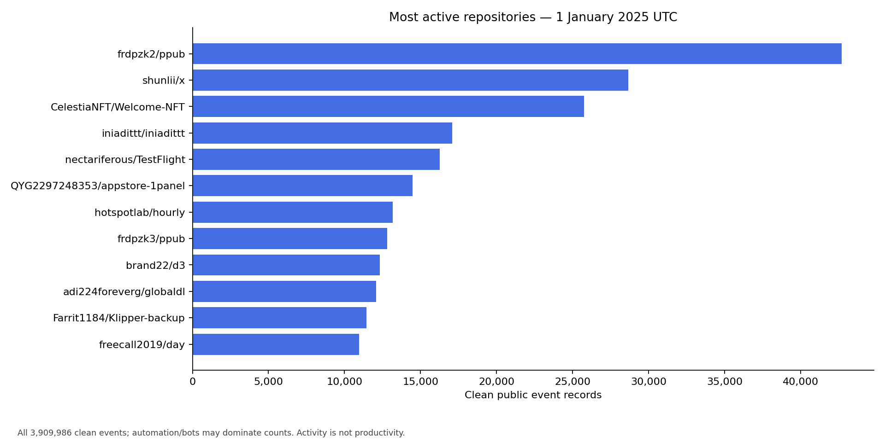
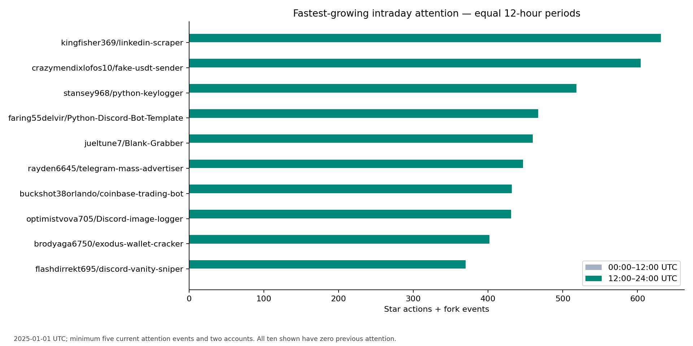
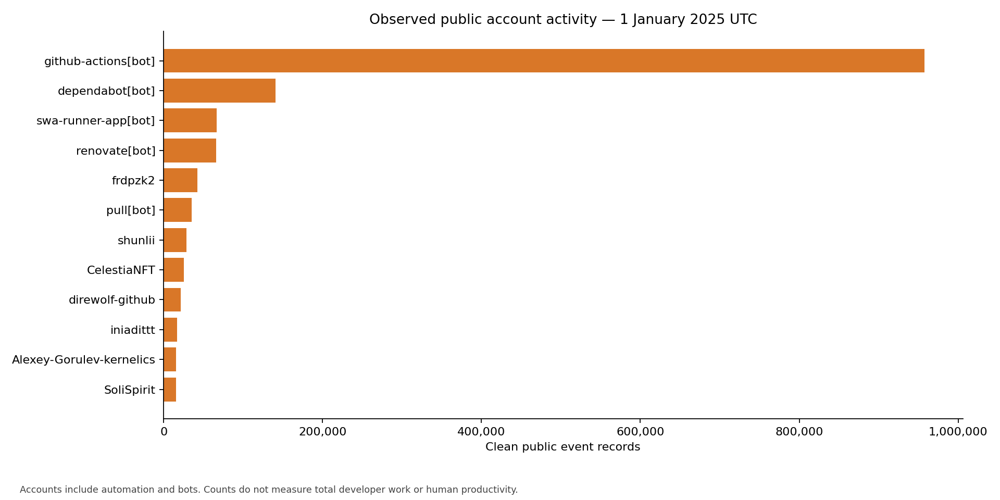
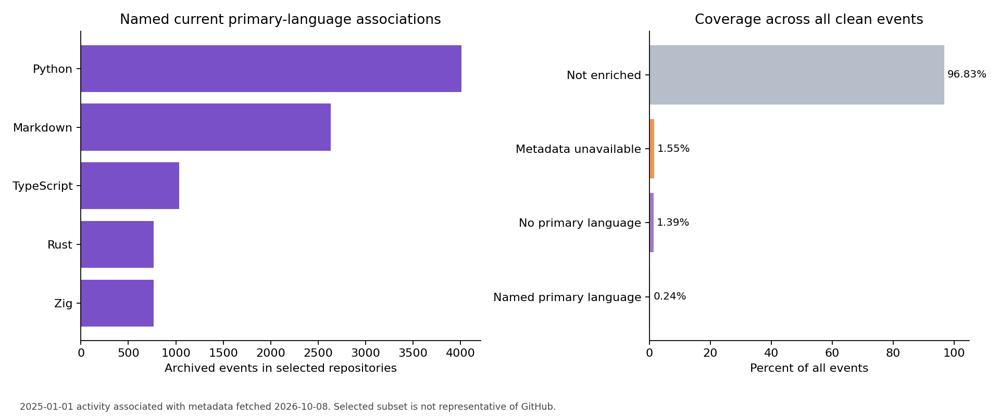

# DevPulse — Week 4 Analytics Report

**Status: COMPLETE — all Week 4 criteria satisfied.**
Integration verified at **2026-10-08T18:00:01.101892+00:00**.
The measured input is the complete **2025-01-01 UTC** day. Current GitHub metadata
was fetched on **2026-10-08**; the two observation dates are kept separate.

## Delivered scope

- [x] Full clean dataset processed into 15 unique-key Parquet tables
- [x] Exact repository and public-account aggregates
- [x] Most-active, intraday, fastest-growth, and emerging-attention rankings
- [x] Reusable comparison of real repositories
- [x] Daily/hourly participation and UTC calendar metrics
- [x] Descriptive collaboration ratio and bounded participation edges
- [x] Public, ID-verified, dated GitHub metadata and checksummed cache
- [x] Primary-language, byte-weighted, and technology associations with coverage
- [x] Normalized exploratory score and alternate-weight evaluation
- [x] Identical rerun uses no API requests and reuses immutable output
- [x] Week 4 and earlier-week tests pass
- [x] Week 1–3 artifacts and source code preserved
- [x] Full-table parity, input conservation, and recorded integration checks
- [x] Operations guide, table contract, reviewed chart artifacts

## Dataset and output

The current Silver snapshot contains **3,909,986 clean unique
public events**, covering 24 archive hours. Week 4 produces exact aggregates for
**683,676 repository IDs** and
**419,709 public account IDs**.
Counts include bots and automation; they are not developer productivity.

The current Gold snapshot is `6e03839285499224b0403539` under
`data/gold/snapshots/`; `data/gold/_CURRENT.json` selects it with a manifest checksum.
All 15 tables have verified keys and row counts. Output files plus checksum sidecars
total **101,172,907 bytes**.

| Parquet table | Saved rows |
|---|---:|
| `repository_metrics` | 683,676 |
| `repository_daily` | 683,676 |
| `repository_hourly` | 1,434,717 |
| `account_metrics` | 419,709 |
| `account_daily` | 419,709 |
| `account_hourly` | 768,349 |
| `activity_calendar` | 1 |
| `hourly_activity` | 24 |
| `participation_edges_sample` | 1,000 |
| `repository_metadata` | 20 |
| `repository_language_shares` | 117 |
| `language_primary_daily` | 9 |
| `language_weighted_daily` | 62 |
| `technology_daily` | 5 |
| `language_intraday_growth` | 9 |

Repository/account whole-window, daily, calendar, and primary-language event totals
each conserve all **3,909,986 events**. Hourly repository/account
groups are sparse; the global hourly table contains all 24 covered hours. A single
Wednesday provides UTC calendar labels but cannot establish weekend or weekly trends.
The sampled participation graph has 1,000 weighted account/repository edges,
limited to 20 star-active repositories and 50 accounts each.

## Repository activity and intraday attention

The most-active ranking orders observed public event totals, with repository ID
breaking ties. Repository names are latest observed archive labels.

| Repository | Stable ID | Events | Active accounts |
|---|---:|---:|---:|
| frdpzk2/ppub | 818567109 | 42,684 | 1 |
| shunlii/x | 910261026 | 28,652 | 1 |
| CelestiaNFT/Welcome-NFT | 895347228 | 25,750 | 1 |
| iniadittt/iniadittt | 800371228 | 17,090 | 1 |
| nectariferous/TestFlight | 840148192 | 16,273 | 1 |
| QYG2297248353/appstore-1panel | 749599017 | 14,475 | 2 |
| hotspotlab/hourly | 902163132 | 13,165 | 1 |
| frdpzk3/ppub | 910454393 | 12,819 | 1 |
| brand22/d3 | 222505696 | 12,330 | 1 |
| adi224foreverg/globaldl | 437227236 | 12,070 | 1 |



Attention means star actions plus fork events. The equal comparison windows are
**00:00–12:00** and **12:00–24:00 UTC**, with half-open boundaries. The smoothed
ratio is `(current+1)/(previous+1)`; absolute deltas and zero-baseline flags accompany
it. A zero baseline has null percentage change. Ranked support requires five
current attention events and two current active accounts. The fastest-growth view
also requires a positive delta. Emerging attention means at most two prior attention
events with qualifying current support; it does not prove the repository is new.

| Intraday score ranking | Previous attention | Current attention | Smoothed ratio | Score |
|---|---:|---:|---:|---:|
| deepseek-ai/DeepSeek-Coder | 82 | 538 | 6.49 | 0.762 |
| bytedance/monolith | 82 | 524 | 6.33 | 0.749 |
| gitroomhq/postiz-app | 19 | 176 | 8.85 | 0.704 |
| caxapok5656/tron-wallet | 0 | 120 | 121.00 | 0.701 |
| feder-cr/Jobs_Applier_AI_Agent | 7 | 105 | 13.25 | 0.683 |
| stansey968/python-keylogger | 0 | 518 | 519.00 | 0.670 |
| towardsai/ai-tutor-rag-system | 0 | 78 | 79.00 | 0.669 |
| jueltune7/Blank-Grabber | 0 | 460 | 461.00 | 0.664 |
| rayden6645/telegram-mass-advertiser | 0 | 447 | 448.00 | 0.662 |
| buckshot38orlando/coinbase-trading-bot | 0 | 432 | 433.00 | 0.660 |



Scores normalize current stars, forks, active accounts, and opened PRs with log1p
relative to dataset maxima and weights **0.4/0.3/0.2/0.1**. The final score combines
70% activity with 30% bounded log growth. These are exploratory choices, not an
evaluated popularity predictor. Different weighting choices change rankings:

| Alternative activity weights | Top-20 overlap with default |
|---|---:|
| balanced | 17/20 |
| star_emphasis | 9/20 |
| participation_emphasis | 17/20 |

`score_sensitivity.json` preserves each alternative's weights and ranked IDs.
The result shows why rankings should not be presented as an objective measure.

Compare the two real star-active repositories used by the audit:

```bash
python -m analytics.query --repo-id 535010087 908531752
```

The saved comparison is `reports/week4/repository_comparison.json`.

## Public accounts and collaboration

The account tables count exact distinct repositories and active dates across the
whole input. Daily distincts are not summed into global unique counts. Opened PRs,
opened issues, issue comments, reviews, and push events have separate counters.
Push records are not commit totals. Code-participating accounts have a documented
operational event definition and do not establish authorship or total work.
`participation_ratio` is distinct participating accounts divided by events, a
proposed descriptive ratio rather than a standard collaboration measure.



## Language enrichment and coverage

The targeted 20-repository selection combines starring, intraday score, and overall
activity. The first collection made **37 actual HTTP requests**
within a 50-request budget, including redirects/retries. It obtained **16 complete
public metadata/language records**, **three not-found outcomes**, and **one repository
ID mismatch**. That mismatch is kept unavailable so a reused name cannot contaminate
historical labels. Current names, byte mixes, creation dates, API star inventories,
ETags, collection timestamps, and raw responses are checksummed and cached.

The complete cache covers **63,615 archived events
(1.63%)**. A named current primary language
covers **9,213 events
(0.24%)**. This is a
selected subset, not representative language market share across GitHub.

| Current primary-language bucket | Metadata status | Repositories | Archived events |
|---|---|---:|---:|
| Not enriched | not_selected | 683,656 | 3,785,957 |
| No primary language reported | ok | 2 | 54,402 |
| Metadata unavailable | not_found | 3 | 43,324 |
| Metadata unavailable | identity_mismatch | 1 | 17,090 |
| Python | ok | 7 | 4,011 |
| Markdown | ok | 2 | 2,635 |
| TypeScript | ok | 3 | 1,035 |
| Rust | ok | 1 | 767 |
| Zig | ok | 1 | 765 |



The byte-weighted table allocates activity according to the current code-byte mix.
Shares sum to one per repository and conserve total events, including explicit
unknown/unavailable/no-language buckets. It estimates associations; it does not
observe the programming language of each event. Technology labels use documented
topic/description rules for AI, cloud, data engineering, and mobile. Multiple
categories may apply, so technology totals are not globally additive.

Current metadata may differ from repository languages/topics in January 2025.
API star/fork inventory is separate from observed historical event counts. Current
metadata must not be backdated into historical prediction features.

## Execution, reuse, and verification

Core aggregation and persisted-table checks took **49.591
seconds**. The final analytics suite invocation took **11.293
seconds**, using the completed core and metadata caches. These are separate phases;
the final invocation is not claimed as the entire initial collection runtime.
The identical invocation reused the same snapshot in **1.146
seconds**, with **zero API requests** and 20 cache hits. Matching recipes avoid Spark
transformation after checksums have been verified.

**131 automated tests passed**, including the earlier 110.
Week 4 tests cover exact distinct participation, event boundaries, latest labels,
growth/zero baselines, score ranges, action semantics, incomplete coverage rejection,
language allocations, unknown buckets, topic boundaries, cache integrity, stable-ID
validation, private-response rejection, HTTP budgets, rate limits, ETags, retries,
safe redirects, and quota rollback. Synthetic fixtures are confined to tests.

The real-data audit checks all 15 table keys and counts; compares **every repository
daily row** against the Week 3 table; verifies global account/repository pairs and
action counters against Silver; checks each equal period; validates pinned cache
identity and language allocation; evaluates alternate score weights; and confirms
**41 prior artifacts/source files** retain
their original fingerprints. File checksums cover current Silver and Gold output.

Spark runs locally on this Mac with a 4 GiB driver and 64 shuffle partitions. The
Gold and core caches have separate 2 GiB logical output budgets, excluding Spark
scratch space. Immutable snapshot staging and atomic publication preserve earlier
outputs; crashes may leave unreferenced staging directories requiring inspection.
This is not a multi-machine scalability benchmark.

## Files and next milestone

- Operations and reader examples: [Week 4 guide](../docs/week4_analytics.md).
- Table keys and meanings: [Gold contract](../docs/contracts/gold_analytics.md).
- Evidence: `reports/week4/integration_verification.json`, test XML/logs,
  `enrichment_run.json`, `initial_run.json`, `idempotent_rerun.json`, comparison,
  and score-sensitivity results.
- Data: `data/gold/snapshots/6e03839285499224b0403539/`, including pinned metadata,
  coverage, bounded rankings, and language previews.

Week 5 is PostgreSQL loading and the interactive analytics dashboard. Forecasting,
orchestration/streaming, and final evaluation remain Weeks 6–8.
