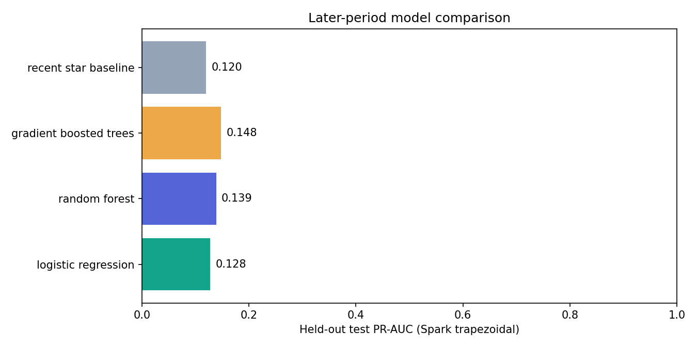
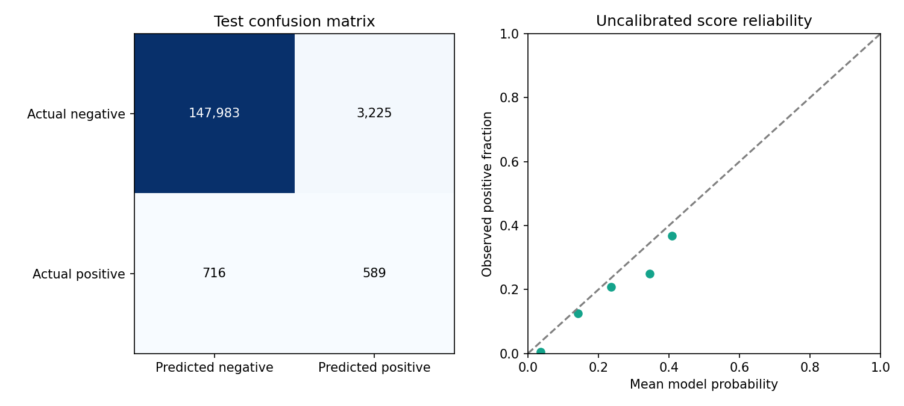

# Week 6 — Chronological repository-popularity prediction

**Status: COMPLETE — evaluated historical experiment.**

Report generated: 2026-10-08T19:39:03.902429+00:00.

## Dataset and scope

The original 2025-01-01 activity dataset and earlier reports are preserved. Week 6 uses a separate complete-hour GH Archive corpus for 2015-01-01 through 2015-02-11: 42 days / 1,008 hourly files. This is a bounded historical experiment; it does not establish current GitHub forecasting performance.

Raw events: **19,669,527**. Projected rows: 19,669,527; rejected rows: 0. Unique events: **19,669,354**. Duplicate rows: 173; conflicting duplicate IDs: 0. Compressed archive bytes: 7,362,227,055.

Events whose creation timestamps fall outside their source week: 0; these are excluded from feature/outcome windows rather than retroactively inserted using a later archive.

## Temporal design and target

Target = 1 when the next seven days contain at least five observed star actions and a gain of at least **7** against the previous seven days. The gain cutoff is the exact 90th percentile of positive training-period gains. Validation/test outcomes do not choose the target.

| Split | First cutoff (UTC) | Last cutoff (UTC) | Latest outcome end (UTC) | Eligible rows | Positives |
|---|---|---|---|---:|---:|
| train | 2015-01-08T00:00:00Z | 2015-01-22T00:00:00Z | 2015-01-29T00:00:00Z | 404,039 | 4159 |
| validation | 2015-01-29T00:00:00Z | 2015-01-29T00:00:00Z | 2015-02-05T00:00:00Z | 155,508 | 1221 |
| test | 2015-02-05T00:00:00Z | 2015-02-05T00:00:00Z | 2015-02-12T00:00:00Z | 152,513 | 1305 |
| forecast | 2015-02-12T00:00:00Z | 2015-02-12T00:00:00Z | 2015-02-19T00:00:00Z | 159,462 | unknown |

Candidates require at least five past-week events. Features include log-transformed star/fork/push/PR/issue/total counts, distinct public and code-participating accounts, active days and within-week star-rate change. Repository IDs/names, later metadata, future counts and target columns never enter the feature vector. Full future windows stay inside their assigned split. Repository IDs may recur across periods; this evaluates future activity for observed repositories.

Training includes three weekly cutoffs. Validation chooses the algorithm by PR-AUC and its decision threshold by F1 on a preregistered grid. The later test period is used only for the final comparison. The saved selected model is reloaded and prediction parity checked.

## Measured comparison

| Algorithm | Split | Precision | Recall | F1 | ROC-AUC | PR-AUC | P@10 | P@100 | Brier |
|---|---|---:|---:|---:|---:|---:|---:|---:|---:|
| logistic_regression | validation | 0.1398 | 0.3604 | 0.2014 | 0.9206 | 0.1190 | 0.0000 | 0.2100 | 0.0074 |
| logistic_regression | test | 0.1587 | 0.3732 | 0.2227 | 0.9217 | 0.1280 | 0.1000 | 0.2200 | 0.0081 |
| random_forest | validation | 0.1406 | 0.3948 | 0.2074 | 0.8845 | 0.1274 | 0.3000 | 0.3600 | 0.0073 |
| random_forest | test | 0.1556 | 0.3977 | 0.2237 | 0.8866 | 0.1387 | 0.2000 | 0.3200 | 0.0079 |
| gradient_boosted_trees | validation | 0.1377 | 0.4373 | 0.2094 | 0.9239 | 0.1324 | 0.3000 | 0.2900 | 0.0082 |
| gradient_boosted_trees | test | 0.1544 | 0.4513 | 0.2301 | 0.9248 | 0.1479 | 0.4000 | 0.2400 | 0.0087 |
| recent_star_ranking_baseline | validation | 0.0351 | 0.9132 | 0.0677 | 0.9097 | 0.1114 | 0.0000 | 0.1400 | ranking only |
| recent_star_ranking_baseline | test | 0.0379 | 0.9149 | 0.0728 | 0.9106 | 0.1203 | 0.1000 | 0.2100 | ranking only |

Selected algorithm: **gradient_boosted_trees**. Frozen decision threshold: 0.1. Test prevalence: 0.8557%. Test PR-AUC versus recent-star ranking: 0.1479 vs 0.1203.

The selected model beats the simple recent-star ranking on this test PR-AUC.

PR-AUC uses Spark’s exact unbinned trapezoidal curve and is not average precision. Scores are uncalibrated probabilities; reliability bins and Brier score expose calibration limitations. Baseline scores are only monotone ranking scores, not probability estimates.

Artifact: `data/models/snapshots/7b1216c89ede73b2b6ac1b25`. Model/runtime duration: 135.767 seconds. Forecast population: 159,462; held-out population: 152,513.

## Verification

Protected earlier-week files: **90**, all unchanged. Native reader role: `devpulse_reader`. Atomic publication rollback and zero-copy database reuse pass. Prediction counts, sums, UTC cutoff and bounds match Parquet. The live page provides rankings, literal search, CSV, measured model comparisons, actual-versus-predicted test results and reliability diagnostics.

| Test group | Passed |
|---|---:|
| unit_tests | 8 |
| integration_tests | 5 |
| regression_tests | 155 |

## Limitations

Only six consecutive weeks, one validation period and one test period are evaluated. No statistical confidence or broad generalization is claimed. Historical archive hours approximate when public activity was observed; actual archive publication latency cannot be reconstructed. Unknown future activity is zero only for completed labelled windows; forecast outcomes remain NULL. Current language metadata is excluded. Repository age and 30-day activity features are omitted because the required lookbacks are incomplete. Event activity includes bots and does not measure developer productivity. The optional seven-day star-count regression enhancement remains outside the required binary-classification milestone.

Operations: [Week 6 guide](../docs/week6_prediction.md). Sources: [GH Archive schema/history](https://www.gharchive.org/) and [Spark 4.0.1 classification](https://spark.apache.org/docs/4.0.1/ml-classification-regression.html).
